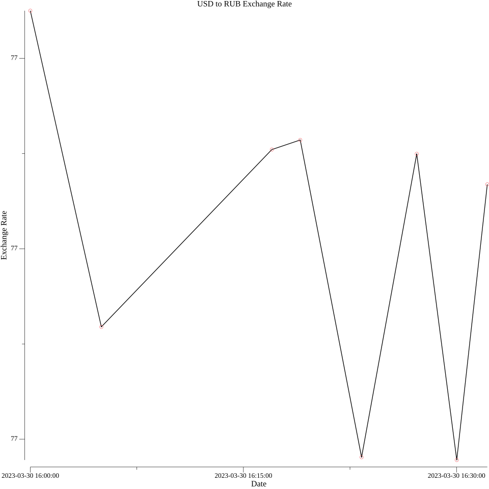

# Курс доллара в рублях

Данная программа извлекает данные курса из API, предоставленным на сайте [APILayer](https://apilayer.com/). Выкладывает эти данные в базу данных типа SQLite. После эти данные идут на создание графика, который после загрузится в свободный доступ на ресурсе [imgBB](https://api.imgbb.com/).

# Как программа работает

программа реализованна через следующие функции:

- [Обработка запроса API из APILayer](#обработка-запроса-api-из-apilayer)
- [Загрузка данных в БД и их обработка в программе](#загрузка-данных-в-бд-и-их-обработка-в-программе)
- [Создание графиков курса изменения доллара в течении конкретного промежутка времени](#создание-графиков-курса-изменения-доллара-в-течении-конкретного-промежутка-времени) 
- [Отправка графиков на imgBB](#отправка-графиков-на-imgbb)

## Обработка запроса API из APILayer    

Чтобы получить API нужно зарегистрироваться на сайте [APILayer](https://apilayer.com/) либо через почту, либо через гугл или github. После регистрации ищем вкладку [Fixer API](https://apilayer.com/marketplace/fixer-api), где мы и получим наш API токен. Прежде чем писать код, ознакомьтесь с документацией, в котором есть примеры, как выглядит простой код на языке Go.\
Поскольку нам нужны изменения курса доллара за небольшой промежуток времени, то воспользуемся запросом типа "/latest". В документации есть пример запроса на языке go

```Go
package main

import (
  "fmt"
  "net/http"
  "io/ioutil"
)

func main() {
  url := "https://api.apilayer.com/fixer/latest?symbols=RUB&base=USD"

  client := &http.Client {}
  req, err := http.NewRequest("GET", url, nil)
  req.Header.Set("apikey", "TOKEN_API")

  if err != nil {
    fmt.Println(err)
  }
  res, err := client.Do(req)
	if res.Body != nil {
    defer res.Body.Close()
  }
  body, err := ioutil.ReadAll(res.Body)

  fmt.Println(string(body))
}
```
В итоге мы получаем json код

```json
{
  "base": "USD",
  "date": "2023-03-30",
  "rates": {
    "RUB": 77.166992
  },
  "success": true,
  "timestamp": 1680179583
}
```
среди этих данных нам нужно достать только RUB. Для этого мы пишем структуру, по которой мы будем снимать данные, в данном случае на надо достать:

```json
  "rates": {
    "RUB": 77.166992
  }
```
Следовательно, описываем структуры, действуем по принципу "из внутри наружу" (да-да я мастер придумывать имена), т.е. сначала зададим структуру для "RUB":
```go
type Rates struct {
    RUB float64 `json:"RUB"`
}
```
И лишь после мы задаем структуру для "rates":
```go
type Response struct {
    Rates Rates `json:"rates"`
}
```
действуя из примера кода предоставленным на сайте, нам остается только заполнить данные через структуры.
## Загрузка данных в БД и их обработка в программе

Перед работой с БД из данного репозитория, вам нужно пересоздать таблицу в файле "Current.db", для этого в консоли в режиме sqlite3 вписать следующие команды:

```SQL
.open Current.db
DROP TABLE exchange_rates;
CREATE TABLE exchange_rates(id INTEGER PRIMARY KEY, currency TEXT, rate DECIMAL, created_at DATE);
.exit
```
В ином случаем вам не нужно прописывать `DROP TABLE`

## Создание графиков курса изменения доллара в течении конкретного промежутка времени 

для создании графиков используется библиотека [gonum.org/v1/plot](https://pkg.go.dev/gonum.org/v1/plot)

перед использованием программы надо скачать утилиту `gnuplot`, ибо на основе этой утилиты и рисуются графики

пример графика:


## Отправка графиков на imgBB

Для работы с данным [ресурсом](https://api.imgbb.com/) надо зарегистрироваться и получить API ключ. 

Картинку надо преобразовать в бинарный файл и запихнуть в форму запроса, а сам запрос мы открываем через метод `POST`.

мои графики в [imgBB](https://redara.imgbb.com/)
